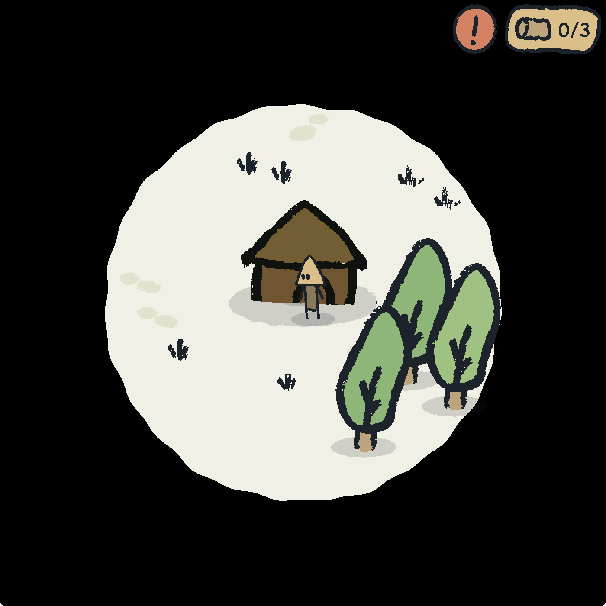
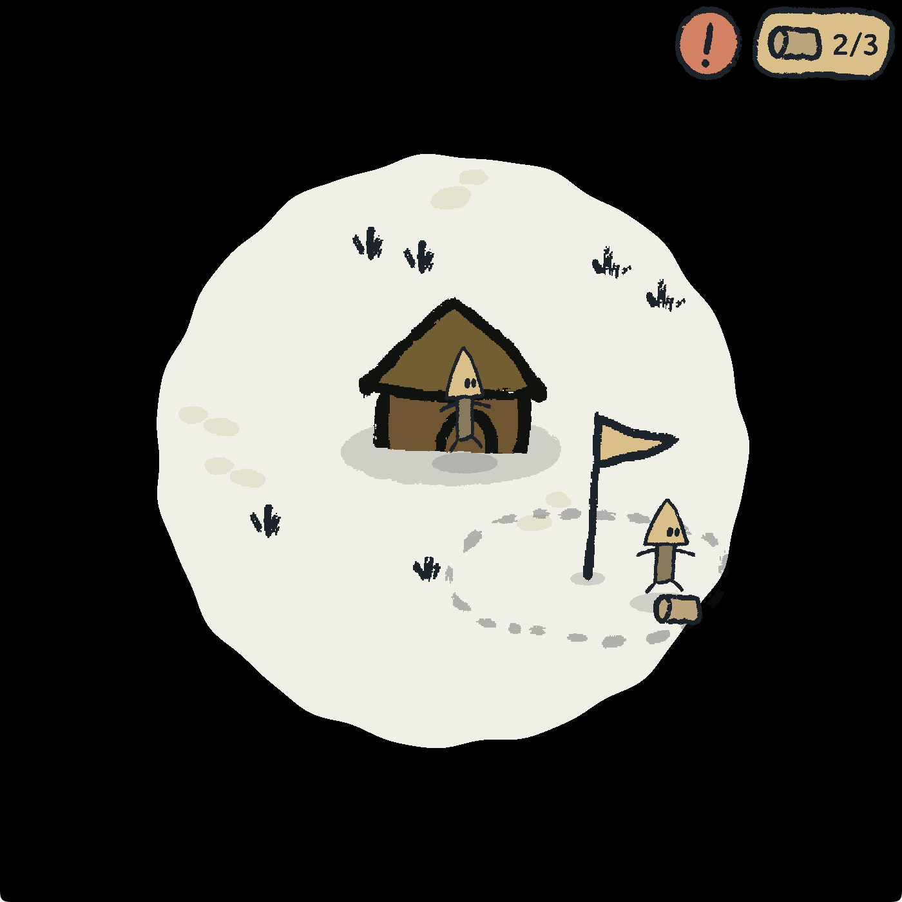
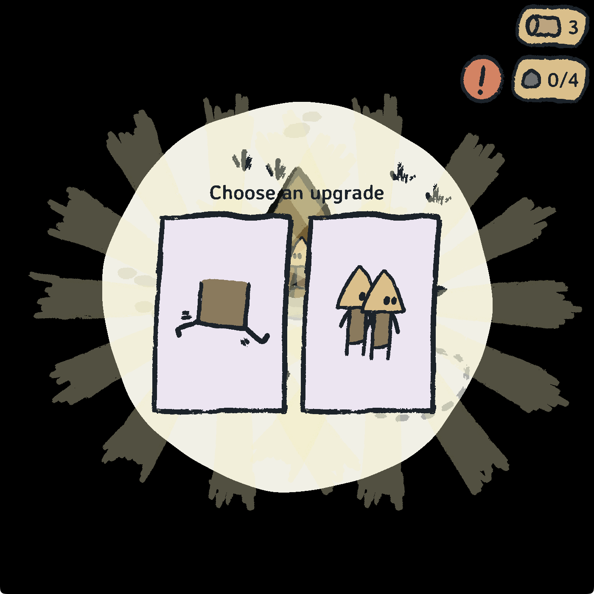
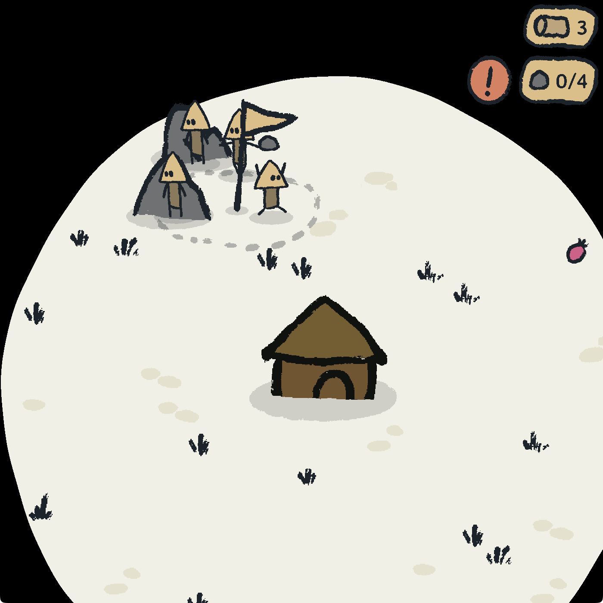
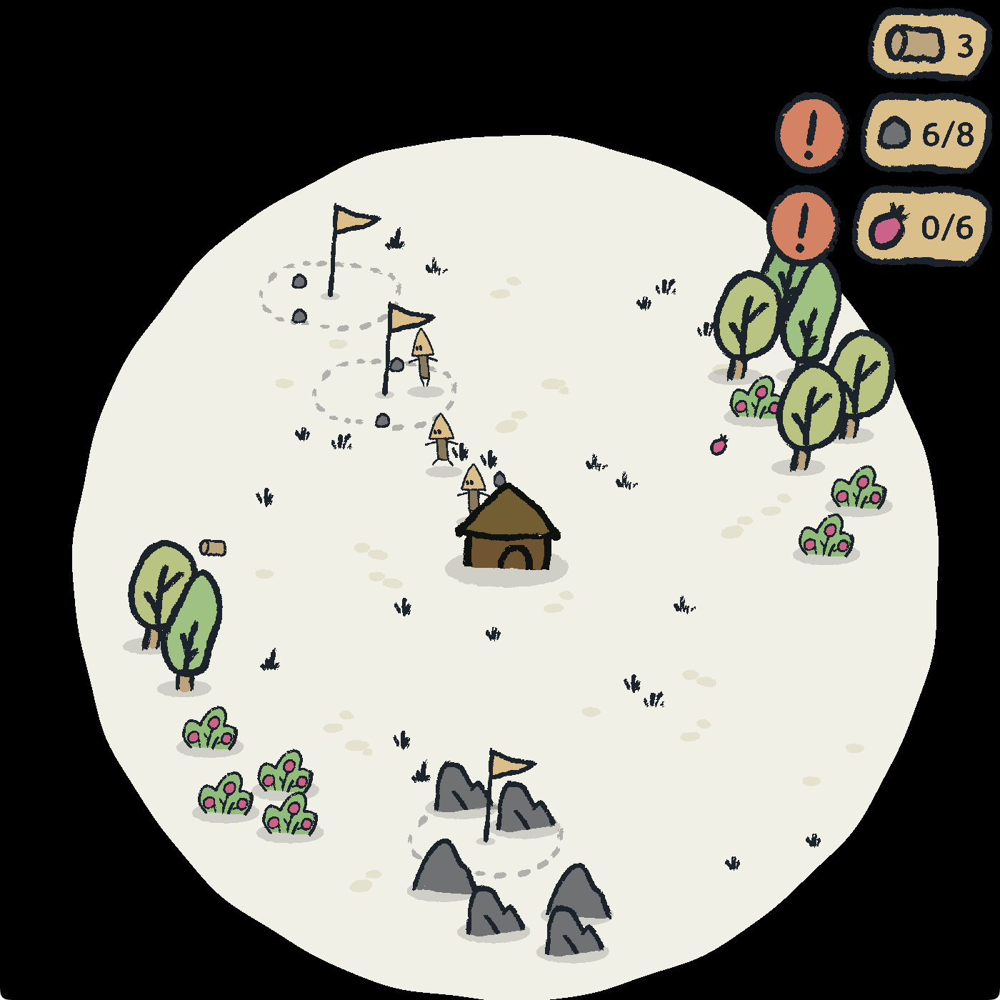
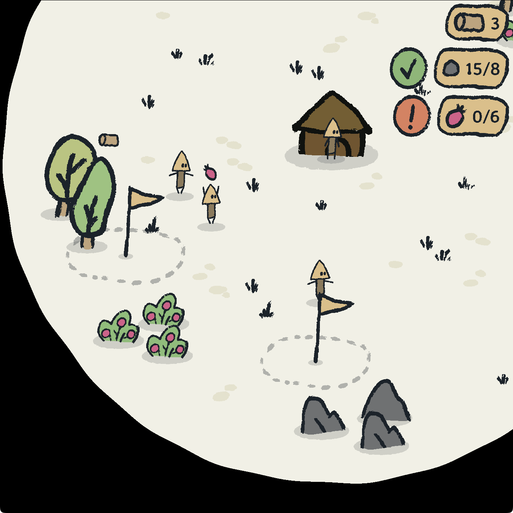

# Outward

Grow your village as the world expands.

## Controls

Use only your mouse. Click and drag to move, mouse wheel to zoom. Click to give orders to your units. Click on an order again to cancel it.

## Known issues

- Well, there’s nothing really to do with the resources you collect. That was “out of scope” for the compo…
- ✅ Fixed: Sometimes the generative music breaks and plays too many chords at the same time, resulting in a LOUD mishmash of notes.
- Sometimes resources near a flag are ignored by units, remove and place the command again to have them register the resources properly.
- Let me know if you find any issues!

## Screenshots

